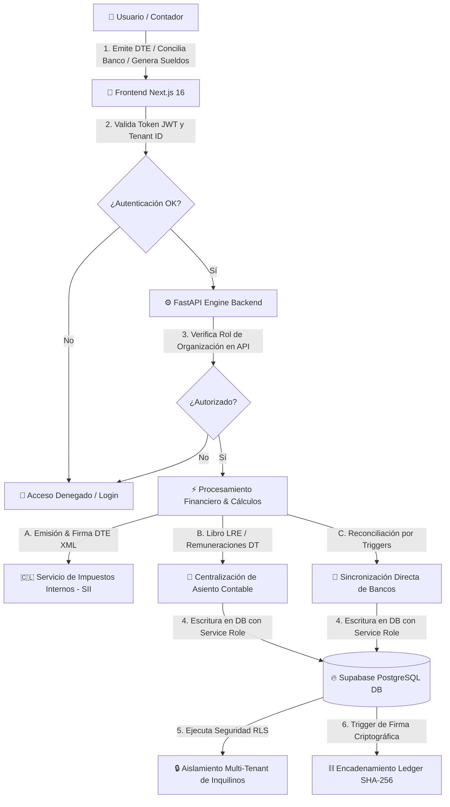

# <p align="center">💎 CONTAPYMEPUQ 💎</p>
<p align="center">
  <strong>Ecosistema Contable Descentralizado de Magallanes (v9.0)</strong>
</p>

<p align="center">
  
  
  
  
</p>

<p align="center">
  <em>"Precisión Institucional, Lógica Superior y Robustez Criptográfica."</em>
</p>

---

## 📖 Descripción General

**Contapymepuq** es la plataforma líder de Software as a Service (SaaS) contable y remunerativo descentralizado, construida específicamente para responder a las exigencias operativas y tributarias de la región de **Magallanes y de la Antártica Chilena**. 

Este ecosistema combina el poder analítico de un motor financiero en **FastAPI (Python)** para el cálculo de sueldos chilenos, conciliación bancaria y firmas de documentos XML, con una interfaz premium basada en **Next.js 16** y el blindaje de seguridad multi-tenant provisto por **Supabase (PostgreSQL RLS)**.

---

## 📊 Flujo de Datos y Arquitectura del Sistema

A continuación se detalla cómo fluyen los datos y cómo opera el blindaje de seguridad y la cadena de integridad del sistema:



---

## 🛠️ Especificación de Stack Tecnológico

| Capa / Componente | Tecnologías Clave | Propósito en el Ecosistema |
| :--- | :--- | :--- |
| **Frontend UI/UX** | Next.js 16 (App Router), React, TypeScript, React-Bootstrap | Interfaz interactiva de alta fidelidad, MarketTicker de Bloomberg y paneles ERP. |
| **Backend Engine** | Python 3.12, FastAPI, Uvicorn, Pydantic v2 | Motor de cálculo de haberes, procesamiento XML, firmas electrónicas y API de conciliación. |
| **Persistencia** | Supabase PostgreSQL, Row Level Security (RLS) | Seguridad multi-tenant por diseño, aislamiento forense de datos. |
| **Criptografía** | SHA-256 Hash Chaining, cryptography (PyCA) | Encadenamiento inmutable de DTEs emitidos para auditorías SII. |
| **Procesamiento** | `lxml` (firmas C14N), `pdfplumber` | Generación y lectura de documentos tributarios oficiales. |

---

## 📁 Arquitectura del Repositorio (Project Structure)

```text
Contapymepuq/
├── app/                      # 🎨 Frontend Web (Next.js 16)
│   ├── src/
│   │   ├── actions/          # Server Actions para llamadas directas a Supabase
│   │   ├── app/              # Rutas físicas (Dashboard, Noticias, Auth)
│   │   ├── components/       # Componentes visuales UI/UX
│   │   └── lib/              # Inicializaciones de Supabase Client & Helpers
│   └── package.json
├── engine/                   # ⚙️ Motor de Procesamiento (Python FastAPI)
│   ├── api/
│   │   └── routers/          # Endpoints de API protegidos por JWT (18 controladores)
│   ├── calculators/          # Motor matemático de remuneraciones chilenas
│   ├── core/
│   │   ├── dte/              # Lógica de creación, firma y envío XML al SII
│   │   └── database.py       # Singleton del conector de Supabase (Service Role)
│   ├── templates/            # Plantillas Word/CSV de finiquitos y contratos
│   └── requirements.txt
├── supabase/                 # 🔥 Base de Datos & Despliegue
│   ├── migrations/           # 78 archivos de migración SQL ordenados cronológicamente
│   └── snapshots/            # Snapshots periódicos del esquema de base de datos
├── docs/                     # 📚 Repositorio de Conocimiento & Auditorías
│   ├── architecture/         # Lógica RLS y flujos de datos
│   ├── audit/                # Gap Analysis, plan técnico DTE y reportes de consistencia
│   └── db/                   # Guía de operaciones y Runbook de Base de Datos
├── tools/                    # 🛠️ Herramientas de Mantenimiento y Validación
│   └── db/                   # Scripts de auditoría, remediación y test multi-tenant
├── start.ps1                 # 🚀 Script único para iniciar el entorno de desarrollo local
└── BLUEPRINT_MAESTRO.md      # 🎯 Fuente Única de Verdad (SSoT) del Roadmap
```

---

## ✨ Características Principales (Features)

*   **🔒 Multi-Tenant Nivel Dios**: Todas las tablas transaccionales están blindadas con políticas de Seguridad a Nivel de Fila (RLS) mediante la función `private.is_org_member(organization_id)`.
*   **🔗 Blockchain-like Ledger**: Encadenamiento inmutable de facturas mediante hash SHA-256 en la tabla `dte_issued`.
*   **🧮 Chilean Payroll Core**: Cálculo preciso de tramos de asignación familiar chilenos, cotizaciones previsionales y topes en UF actualizados.
*   **🏦 Conciliación Bancaria Avanzada**: Sincronización inmutable del estado de reconciliación en tiempo real mediante triggers y funciones nativas PostgreSQL.
*   **📰 Diario Descentralizado**: Motor agregador de noticias regionales (`regional_news`) integrado con SEO avanzado y slugs inmutables.

---

## 🚀 Inicio Rápido para Desarrolladores

Para levantar el entorno completo de desarrollo de forma unificada, abre una terminal de **PowerShell** en la raíz del proyecto y ejecuta:

```powershell
.\start.ps1
```

Este script automatizado levantará concurrentemente:
*   El **Frontend** en `http://localhost:3000`
*   El **Backend Engine** en `http://localhost:8000` (Documentación Swagger interactiva en `/docs`)

---

## 🧪 Pruebas y Validación (Testing)

El ecosistema cuenta con tests automatizados para asegurar la integridad de la lógica financiera y la seguridad de los tenants:

```bash
# Correr tests unitarios y lógicos del motor de sueldos
engine\.venv\Scripts\python.exe -m pytest tests/engine

# Correr pruebas de integración de base de datos y consistencia
engine\.venv\Scripts\python.exe -m pytest tests/database
```

---

<p align="center">
  <sub>© 2026 Contapymepuq. Todos los derechos reservados. Desarrollado con ❤️ para la Región de Magallanes, Chile.</sub>
</p>
