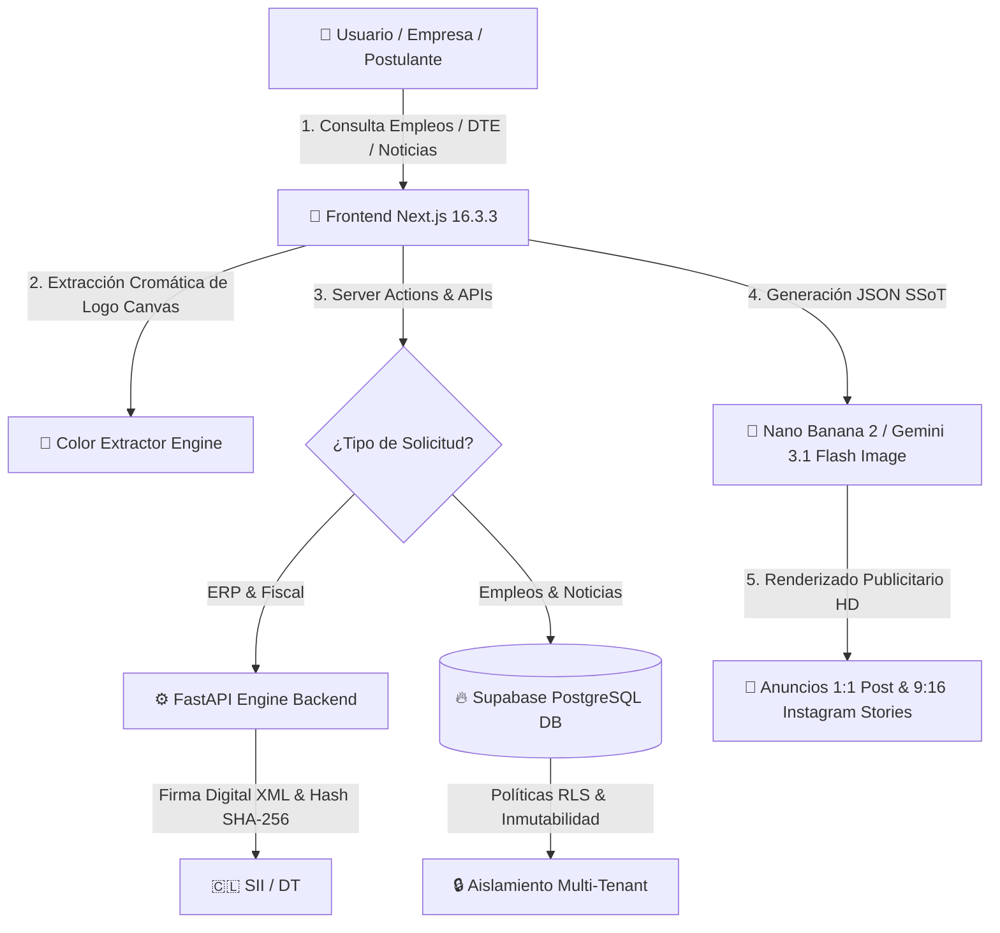

# <p align="center">💎 CONTAPYMEPUQ 💎</p>
<p align="center">
  <strong>Ecosistema Contable, Informativo y Laboral Descentralizado de Magallanes (v16.0)</strong>
</p>

<p align="center">
  
  
  
  
  
</p>

<p align="center">
  <em>"Precisión Institucional, Lógica Superior y Ecosistema Productivo para la Patagonia Austral."</em>
</p>

---

## 📖 Descripción General

**Contapymepuq** es la plataforma líder de Software as a Service (SaaS) contable, informativo y laboral descentralizado, construida específicamente para responder a las exigencias operativas, tributarias y productivas de la región de **Magallanes y de la Antártica Chilena**.

Este ecosistema integra cuatro pilares fundamentales:
1. **ERP & Contabilidad Austral:** Facturación Electrónica DTE (SII), Nómina con Ley 40 Horas / Ley Karin y Conciliación Bancaria con cadena de integridad criptográfica SHA-256.
2. **ContaEmpleos Magallanes (`/empleos`):** Bolsa de trabajo regional auditada bajo el **Artículo 2° del Código del Trabajo** con estimador previsional de sueldo líquido.
3. **Generador Publicitario de Co-Branding con IA:** Extracción cromática automática de logos de empresas y generación determinista de anuncios para **Nano Banana 2 (Gemini 3.1 Flash Image)** en formatos **Post 1:1** e **Historia 9:16**.
4. **Diario Regional Descentralizado (`/noticias`):** Noticias locales verificadas, indicadores macroeconómicos y meteorología austral en tiempo real.

---

## 📊 Flujo de Datos y Arquitectura del Sistema



---

## 🛠️ Especificación de Stack Tecnológico

| Capa / Componente | Tecnologías Clave | Propósito en el Ecosistema |
| :--- | :--- | :--- |
| **Frontend UI/UX** | Next.js 16.3.3 (App Router), React 19, TypeScript, Tailwind CSS, Base UI | Portal público, catálogo de empleos, generador social y dashboard ERP. |
| **Backend Engine** | Python 3.12, FastAPI, Uvicorn, Pydantic v2, APScheduler | Motores de cálculo previsional, workers de ingesta y auditoría legal. |
| **Persistencia** | Supabase PostgreSQL, Row Level Security (RLS) | Base de datos relacional multi-tenant con seguridad a nivel de fila. |
| **Branding & IA** | HTML5 Canvas Color Quantization, Gemini 3.1 Flash Image Spec | Extracción automática de paletas corporativas y prompts de grado de estudio. |
| **Criptografía** | SHA-256 Hash Chaining, cryptography (PyCA) | Encadenamiento inmutable de DTEs y certificados de verificación pública. |

---

## 📁 Arquitectura del Repositorio

```text
Contapymepuq/
├── app/                      # 🎨 Frontend Web (Next.js 16.3.3)
│   ├── public/branding/      # Kits de marca oficiales y especificaciones JSON
│   ├── src/
│   │   ├── actions/          # Server Actions (Empleos, Documentos, Parámetros)
│   │   ├── app/              # Rutas físicas (/empleos, /noticias, /dashboard, /verify)
│   │   ├── components/       # Componentes UI (Generador social, calculadoras, filtros)
│   │   └── lib/branding/     # color-extractor.ts (Extracción cromática de logos)
│   └── package.json
├── engine/                   # ⚙️ Motor de Procesamiento (Python FastAPI)
│   ├── api/routers/          # Controladores REST protegidos por JWT
│   ├── calculators/          # Motor de remuneraciones y liquidaciones chilenas
│   ├── workers/              # job_worker.py & news_worker.py (Ingesta periódica y auditoría)
│   ├── core/                 # DTE, base de datos y utilidades criptográficas
│   └── requirements.txt
├── supabase/                 # 🔥 Base de Datos & Despliegue
│   ├── migrations/           # Migraciones SQL cronológicas (job_postings, news, RLS)
│   └── snapshots/            # Esquemas relacionales históricos
├── tests/                    # 🧪 Test Suite Integral
│   ├── test_job_banner_generation.py  # Pruebas de esquemas Nano Banana y branding
│   └── test_jobs_pipeline_and_compliance.py  # Pruebas de cumplimiento legal Art. 2° DT
├── start.ps1                 # 🚀 Script de inicio del ecosistema local
└── BLUEPRINT_MAESTRO.md      # 🎯 Fuente Única de Verdad (SSoT) de Arquitectura
```

---

## ✨ Características Principales (Features v16.0)

*   **💼 ContaEmpleos Magallanes:**
    *   Filtros inteligentes por Comuna (Punta Arenas, Puerto Natales, Porvenir, Faena).
    *   Auditoría de legalidad bajo el Artículo 2° del Código del Trabajo (anti-discriminación).
    *   Estimación de Sueldo Líquido con cálculo de descuentos previsionales chilenos.
*   **🎨 Kit de Publicidad & Co-Branding con IA:**
    *   Carga de logotipos de empresas y extracción automática de códigos HEX corporativos.
    *   Renderizado en vivo en formato **Post 1:1** e **Historia 9:16**.
    *   Pestaña `[JSON Nano Banana]` con la especificación completa para Gemini 3.1 Flash Image.
    *   Copia automática de URL para el **Sticker de Enlace de Instagram** y Web Share API.
*   **🔒 Multi-Tenant Nivel Dios:** RLS activo en todas las tablas transaccionales.
*   **📜 Portal de Verificación Pública (`/verify/[id]`):** Validación inmutable mediante códigos QR de contratos, liquidaciones y balances contables.

---

## 🧪 Verificación y Calidad

```bash
# Ejecutar pruebas unitarias de backend y branding
python -m pytest tests/ -v

# Validar tipado TypeScript
cd app && npx tsc --noEmit

# Compilación de producción en Next.js
npm run build
```

---
© 2026 Contapymepuq — Todos los derechos reservados. Magallanes y de la Antártica Chilena.
