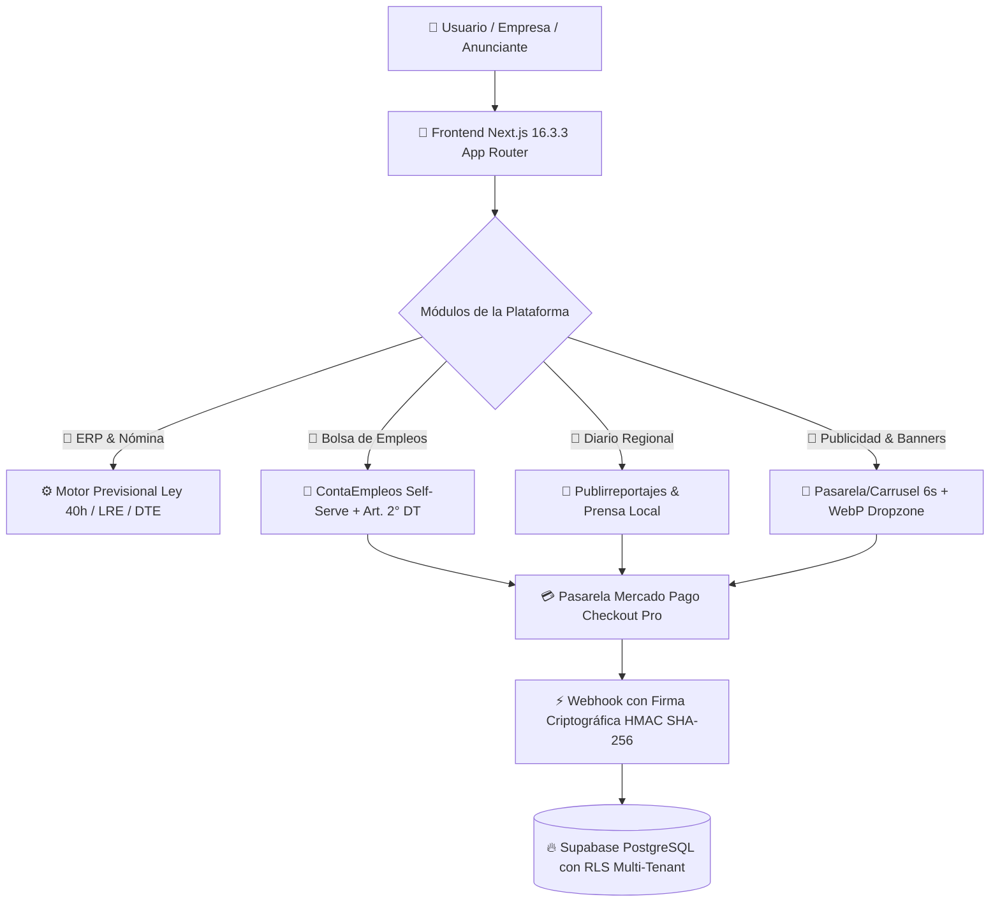

# <p align="center">💎 CONTAPYMEPUQ 💎</p>
<p align="center">
  <strong>Ecosistema Contable, Informativo, Laboral y Publicitario de Magallanes (v20.0)</strong>
</p>

<p align="center">
  
  
  
  
  
</p>

<p align="center">
  <em>"Precisión Institucional, Lógica Superior y Ecosistema Productivo para la Patagonia Austral."</em>
</p>

---

## 📖 Descripción General

**ContaPymePUQ** es el ecosistema digital líder para la región de **Magallanes y de la Antártica Chilena**, integrando cuatro motores productivos de alto impacto:

1. **🏢 ERP & Contabilidad Austral:** Facturación Electrónica DTE (SII), Nómina legal con **Ley 40 Horas / Ley Karin**, generación del **Libro de Remuneraciones Electrónico (LRE)** para la DT y Conciliación Bancaria con cadena criptográfica SHA-256.
2. **💼 ContaEmpleos Magallanes (`/empleos` y `/publicar-empleo`):** Bolsa laboral regional de autoservicio (Self-Serve) con auditoría bajo el **Art. 2° del Código del Trabajo**, cálculo de sueldo líquido y pagos automáticos con Mercado Pago.
3. **🎨 Generador Publicitario Co-Branding con IA:** Cuantización cromática de logos vía Canvas y generación determinista de piezas en formato **Post 1:1** e **Historia 9:16** con especificación para **Nano Banana 2 (Gemini 3.1 Flash Image)**.
4. **📰 Diario Regional & Media Kit Publicitario (`/noticias`, `/anunciar` y `/dashboard/publicidad`):**
   * Portal de noticias con deduplicación semántica y publirreportajes pagados.
   * **Mega Banner Header**, Banner en Calculadora y Banner Lateral con **Carrusel Inteligente (6s)** y pausa en hover.
   * **Control de Capacidad (Máx 5 marcas)** con badges de escasez (`🔥 ¡Último Cupo!`, `🔒 CUPOS AGOTADOS`).
   * **Subida de Archivos con Compresión WebP en el navegador** (-80% peso).

---

## 📊 Arquitectura del Ecosistema



---

## 🛠️ Especificación de Stack Tecnológico

| Capa / Componente | Tecnologías Clave | Propósito |
| :--- | :--- | :--- |
| **Frontend Web** | Next.js 16.3.3 (Turbopack), React 19, TypeScript, Tailwind CSS, Lucide | 61 rutas en producción: portales públicos, carrusel de banners y dashboard empresarial. |
| **Backend & Workers** | Python 3.12, FastAPI, Pydantic v2, APScheduler | Motores de cálculo previsional, ingesta de noticias, auditoría legal y RCV. |
| **Base de Datos** | Supabase PostgreSQL, Row Level Security (RLS) | Almacenamiento seguro multi-tenant con partición por organización. |
| **Pasarela de Pagos** | Mercado Pago Checkout Pro + Webhooks HMAC | Cobros automatizados en empleos, publirreportajes, banners y suscripciones ERP. |
| **Compresión & Media** | HTML5 Canvas Client-Side, WebP Image Compressor | Reducción de 70%-90% de peso de imágenes antes de subir a Storage. |
| **Test Suite** | Pytest (202 tests) + Next.js Typecheck | Validación integral de algoritmos fiscales, seguridad y estados. |

---

## 🚀 Inicio Rápido

Para levantar el entorno completo local:

```powershell
# Iniciar Frontend Next.js y Engine FastAPI
.\start.ps1
```

* **Frontend Web:** `http://localhost:3000`
* **Engine API & Swagger:** `http://localhost:8000/docs`
* **Ejecutar Pruebas Unitarias:** `python -m pytest tests/ -v`

---

## 📁 Estructura del Repositorio

```text
Contapymepuq/
├── app/                        # 🎨 Frontend Web Next.js 16.3.3
│   ├── src/
│   │   ├── actions/            # Server Actions (Ads, Empleos, Noticias, Nómina)
│   │   ├── app/                # 61 Rutas (Dashboard, Empleos, Noticias, Anunciar, Checkout)
│   │   ├── components/         # Componentes UI (Carrusel, Publicador, Calculadora, Sidebar)
│   │   └── lib/media/          # image-compressor.ts (Compresión WebP en navegador)
│   └── package.json
├── engine/                     # ⚙️ Motor Backend Python FastAPI
├── docs/                       # 📚 Documentación Maestra y Auditoría Institucional
├── tests/                      # 🧪 Suite de 202 Pruebas Unitarias
│   ├── test_dynamic_ad_banners_ecosystem.py  # Tests de Banners, Rotación y Capacidad
│   ├── test_jobs_pipeline_and_compliance.py   # Tests Art. 2° DT
│   └── test_mercadopago_checkout_and_orders.py# Tests Webhooks y Pagos
├── BLUEPRINT_MAESTRO.md        # 🎯 SSoT de Arquitectura y Roadmap
└── README.md                   # 📖 Presentación General del Proyecto
```
