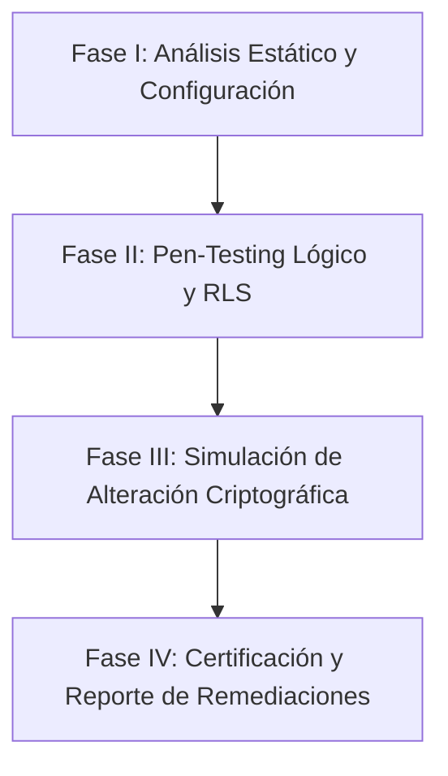

# 🛡️ Propuesta de Auditoría Profesional de Integridad y Seguridad
## Proyecto: CONTAPYMEPUQ — Ecosistema Contable Magallánico
**Versión de Referencia:** v8.6 (Certified Financial Integrity 📜)  
**Preparado para:** Matías Riquelme  
**Fecha:** 25 de Mayo, 2026  

---

## 🎯 1. Objetivo General
El objetivo de esta propuesta es establecer un marco formal de **Auditoría Profesional Multidimensional** para **Contapymepuq v8.6**. Esta auditoría validará de forma exhaustiva la seguridad multi-tenant, la inmutabilidad de los datos, el cumplimiento tributario ante el Servicio de Impuestos Internos (SII) de Chile y la calidad de la interfaz ("Luxury ERP"), preparando la plataforma para su fase final de despliegue y certificación comercial.

---

## 🔍 2. Alcance y Módulos de la Auditoría

```text
┌─────────────────────────────────────────────────────────────────────────┐
│              AUDITORÍA PROFESIONAL CONTAPYMEPUQ v8.6                    │
├───────────────────┬───────────────────┬───────────────────┬─────────────┤
│ 🔐 CRIPTOGRAFÍA   │ 🏛️ CUMPLIMIENTO   │ 🎨 FRONTEND       │ ⚙️ DEVOPS    │
│ - Hash Chaining   │ - Firma XML (SII) │ - Next.js 16 A11y │ - IaC Render│
│ - RLS Hardening   │ - CAF / Folios    │ - Caching (SWR)   │ - Secrets   │
│ - Ledger Verify   │ - Leyes Chile2026 │ - Refactoring     │ - E2E Tests │
└───────────────────┴───────────────────┴───────────────────┴─────────────┘
```

### Módulo 1: Seguridad Criptográfica y Cadena de Integridad (SHA-256 Ledger)
Este módulo se enfoca en auditar el "Blockchain Ledger" propietario del sistema, asegurando que la contabilidad y los DTEs sean inmutables y resistentes a alteraciones forenses.
*   **Auditoría de Encadenamiento en Python:** Inspección del código en `engine/core/dte/dte_logic.py` para asegurar que el cálculo del `integrity_hash` siga el estándar `Hash(n) = SHA256(Payload(n) + Hash(n-1))`.
*   **Bloque Génesis:** Validar la semilla de inicialización criptográfica para nuevas organizaciones para evitar ataques de replay o inyección retroactiva de DTEs.
*   **Simulación de Alteración (Pen-Testing Contable):** Escribir scripts de prueba controlados para modificar registros directamente en la base de datos (Supabase) y certificar que el sistema detecte inmediatamente la ruptura de la cadena y bloquee cualquier acción subsecuente.

### Módulo 2: Aislamiento Multi-Tenant y Seguridad de Datos (Supabase RLS)
Garantizar que el "muro multi-tenant" sea infranqueable a nivel de base de datos.
*   **Auditoría Exhaustiva de RLS (Row Level Security):** Verificación de políticas aplicadas en PostgreSQL para tablas críticas:
    *   `profiles` (Gestión de usuarios y accesos)
    *   `dte_issued` y `dte_caf_folios` (Facturación y folios)
    *   `purchase_records` y `economic_indicators` (Finanzas y ticker de mercado)
*   **Bypass Controlado:** Auditar la lógica de llamadas del motor Python Engine usando Service Roles para asegurar que no existan fugas de datos colaterales entre inquilinos.
*   **Gobernanza de Logs (Audit Logs GRC):** Asegurar que las acciones críticas queden registradas con metadatos inviolables en `audit_logs` y verificar las políticas de rotación de 6 meses.

### Módulo 3: Cumplimiento Normativo SII (DTE y Remuneraciones)
Verificar que la lógica tributaria y de nómina responda estrictamente a los requerimientos legales vigentes en Chile.
*   **Firma Digital y XML:** Certificar que la generación de XML DTE cumpla con la estructura de firma usando algoritmos de canonización `C14N` y criptografía `PKCS#1 v1.5` (SHA1 / SHA256).
*   **Gestión de Folios (CAF):** Validar el ciclo de vida de los archivos CAF cargados mediante `engine/upload_cafs.py`, asegurando que no se puedan inyectar folios duplicados o fuera de rango.
*   **Remuneraciones Magallanes (Chile 2026):** Auditar `engine/calculators/chilean_payroll.py` para ratificar:
    *   Cálculo de jornada laboral bajo la ley de 42 horas semanales.
    *   Cálculos actualizados de Asignación Familiar, Seguro de Cesantía y topes imponibles chilenos para 2026.
    *   Estructura matemática de impuestos de segunda categoría.

### Módulo 4: Elevación de Calidad Frontend ("Luxury ERP" Standard)
Optimizar la aplicación Next.js 16 para garantizar que se sienta premium, reactiva y accesible.
*   **Refactorización de Componentes Cliente Monolíticos:** Dividir componentes grandes como `ExecutiveDashboardClient` en sub-componentes atómicos reutilizables y limpios.
*   **Optimización del Ciclo de Vida y Caché:** Sustituir peticiones manuales con `useEffect` en la UI por soluciones de caching estructuradas como **SWR** o **TanStack Query** para la carga dinámica de datos e indicadores.
*   **Resolución de Warnings de Hidratación:** Eliminar los `suppressHydrationWarning` innecesarios normalizando el renderizado de fechas locales y zonas horarias en servidor vs cliente.
*   **Accesibilidad (A11y) y SEO:** Implementar "Skip Links", optimizar imágenes utilizando formatos modernos (.webp) mediante `next/image` con prioridades, y asegurar los metadatos OpenGraph.

### Módulo 5: DevOps, Secretos y Producción (Fase 13)
Validar que el paso de Staging a Producción cumpla con altos estándares de seguridad operativa.
*   **Auditoría de Secrets:** Validar que las variables de entorno, llaves privadas de firmas SII, y llaves de Supabase se gestionen de forma segura (sin persistir en código ni logs de build).
*   **Infraestructura como Código (IaC):** Inspeccionar el archivo `render.yaml` y la configuración de Dockerfile del motor FastAPI para optimizar la escalabilidad.
*   **Simulación del SII:** Crear un ambiente de prueba aislado (Mock SII Sandbox) para pruebas E2E de emisión y timbrado sin incurrir en transacciones reales.

---

## 🛠️ 3. Metodología de Ejecución Propuesta

La auditoría se llevará a cabo en **4 fases iterativas**, utilizando herramientas automatizadas y análisis manual:



1.  **Fase I: Análisis de Estructura y Código (Estático)**
    *   Ejecución de validadores de TypeScript y Linters.
    *   Mapeo automatizado del esquema de base de datos contra el historial de migraciones de Supabase.
2.  **Fase II: Pruebas Dinámicas y RLS Verification**
    *   Inyección de queries simuladas de Tenant B intentando acceder a recursos de Tenant A.
    *   Comprobación de filtros en endpoints de FastAPI.
3.  **Fase III: Simulación forense de integridad**
    *   Simular alteraciones en los hashes de DTEs y verificar la respuesta de auto-bloqueo del sistema.
    *   Test de carga de CAF inválidos o manipulados.
4.  **Fase IV: Informe de Remediación y Certificación**
    *   Elaboración de reportes específicos con parches de código listos para aplicar.

---

## 🏆 4. Entregables
Al concluir el proceso de auditoría, se entregarán los siguientes documentos en la carpeta `docs/audit/`:
1.  `db_audit_report.md`: Trazabilidad completa del esquema de BD, discrepancias de migración y estado de las políticas RLS.
2.  `cryptographic_integrity_cert.md`: Certificación del correcto funcionamiento del ledger SHA-256.
3.  `sii_compliance_checklist.md`: Verificación de firma XML, validaciones de RUT y estados de folios CAF.
4.  `frontend_optimization_plan.md`: Mapa detallado para la refactorización de componentes cliente a fin de lograr la experiencia "Luxury ERP".

---
> **Estado de la Propuesta:** Esperando revisión y aprobación del cliente para definir las prioridades del cronograma.
