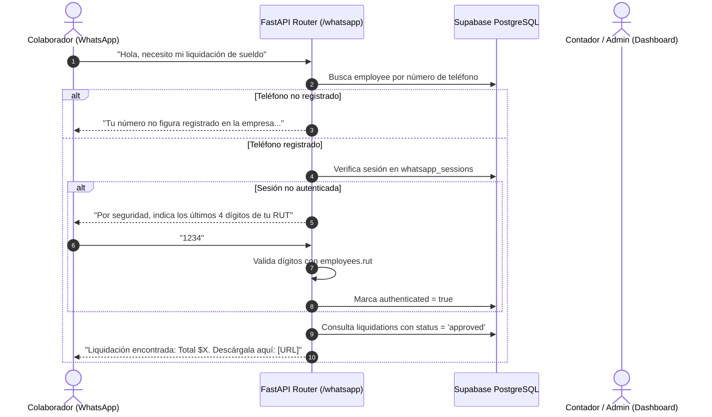

# 🏛️ ARQUITECTURA TÉCNICA: PORTAL DE AUTOATENCIÓN WHATSAPP & ASISTENTE LEGAL SII
**ContaPymePUQ — Especificación de Ingeniería v22.1**
**Área:** Recursos Humanos, Legal Tributario & Integración Multi-Tenant

---

## 1. 🤖 PORTAL DE AUTOATENCIÓN LABORAL VÍA WHATSAPP

### 1.1 Objetivo y Alcance
Brindar a los 189 colaboradores de las 37 empresas clientes de Magallanes un canal conversacional 24/7 para consultar sus remuneraciones, feriado legal y documentación laboral, reduciendo en un 90% la carga administrativa manual del departamento de contabilidad y RRHH.

### 1.2 Flujo de Autenticación en Dos Pasos (2FA)
Para proteger la privacidad de las liquidaciones y datos sensibles, el motor implementa un handshake criptográfico y contextual:
1. **Identificación Inicial:** El colaborador envía un mensaje desde su número telefónico. El sistema consulta `employees.telefono` filtrado por la organización activa.
2. **Desafío 2FA:** Antes de despachar liquidaciones o certificados, el bot solicita los **últimos 4 dígitos del RUT** del colaborador (sin dígito verificador).
3. **Validación:** Se normaliza el RUT almacenado (`re.sub(r'[^0-9kK]', '', rut)`) y se comparan los 4 dígitos precedentes al guion. Al coincidir, la sesión en `whatsapp_sessions` queda autenticada (`is_authenticated = true`, `auth_stage = 'authenticated'`) y se reinician los intentos fallidos.
4. **Protección contra Fuerza Bruta:** Cada intento inválido incrementa `failed_attempts`. Al acumular 3 intentos erróneos, la sesión se bloquea fijando `locked_until = now() + INTERVAL '30 minutes'`, impidiendo consultas no autorizadas.

### 1.3 Lógica Territorial de Vacaciones (Magallanes)
A diferencia del régimen nacional general de 15 días hábiles al año, ContaPymePUQ aplica estrictamente el **Art. 67 inc. 2 del Código del Trabajo** para la XII Región de Magallanes y de la Antártica Chilena:
$$	ext{Días Acumulados} = rac{	ext{Días Trabajados} 	imes 20}{365.25}$$
* El bot consulta la tabla `vacation_requests` con `status = 'approved'` y calcula el saldo neto disponible en tiempo real:
$$	ext{Saldo Disponible} = 	ext{Días Acumulados} - \sum 	ext{Días Aprobados}$$

---

## 2. ⚖️ ASISTENTE LEGAL TRIBUTARIO & GENERADOR DE ESCRITOS SII (.DOCX)

### 2.1 Objetivo y Fundamento Jurídico
Automatizar la elaboración de descargos y rectificatorias formales ante fiscalizaciones del **Servicio de Impuestos Internos (SII), Dirección Regional de la XII Región (Unidad Punta Arenas)**, reduciendo tiempos de redacción jurídica de horas a segundos.

### 2.2 Catálogo de Causas y Normativa Aplicada
1. **Boletas vs. Facturas (Venta a Consumidor Final):**
   * *Fundamento:* **Art. 53 D.L. N° 825** y **Art. 35 del Reglamento de IVA**.
   * *Argumento:* Acredita que las ventas del giro (ej. gastronomía, comercio minorista) se efectúan a público consumidor final, el cual no requiere factura. Demuestra que el IVA Débito Fiscal fue declarado y pagado íntegramente en los Formularios 29, existiendo **ausencia absoluta de perjuicio fiscal**.
2. **Respuesta Formal a Citación Art. 63 del Código Tributario:**
   * *Fundamento:* **Art. 63 D.L. N° 830**.
   * *Argumento:* Evacúa descargos dentro del plazo fatal legal, acompañando registros de compra y venta (RCV) y libros auxiliares.
3. **Solicitud de Rectificatoria Voluntaria F29 (Error de Hecho):**
   * *Fundamento:* **Art. 127 del Código Tributario**.
   * *Argumento:* Corrección de códigos mal imputados por error material involuntario, sin variación del impuesto efectivamente devengado.
4. **Condonación de Multas e Intereses:**
   * *Fundamento:* **Circular N° 50 del SII** y **Art. 6° Letra B N° 4 del Código Tributario**.
   * *Argumento:* Solicitud fundada al Director Regional acreditando cumplimiento histórico, intachable conducta y buena fe.

### 2.3 Estándar Formal de Salida (.docx)
El módulo utiliza `python-docx` configurando las directrices de presentaciones judiciales y administrativas en Chile:
* **Tipografía:** Times New Roman 11 pt, interlineado 1.15, texto justificado.
* **Márgenes Oficiales:**
  * Superior: 3.0 cm
  * Inferior: 2.5 cm
  * Izquierdo: 3.5 cm (espacio para timbraje y archivo)
  * Derecho: 2.5 cm
* **Estructura Forense:** Cabecera territorial en Punta Arenas, Suma, Comparecencia con RUT y Representante Legal, Hechos y Derecho en capítulos numerados (`I`, `II`, `III`), Petitorio formal ("POR TANTO") y línea de firma.

---

## 3. 🛡️ SEGURIDAD, PERMISOS Y PROCEDIMIENTOS RLS

### 3.1 Aislamiento Multi-Tenant
* **Lectura (`SELECT`):** Las tablas `whatsapp_org_settings`, `whatsapp_message_logs` y `sii_defense_documents` cuentan con políticas RLS basadas en `private.is_org_member(organization_id)`.
* **Escritura (`INSERT`, `UPDATE`):** Restringida a roles administrativos (`owner`, `admin`, `accountant`) validada en dos capas:
  1. En el Gateway Next.js BFF (`app/src/app/api/sii/generate/route.ts`).
  2. En el backend FastAPI vía dependencia `verify_org_role(payload.organization_id, auth=current_user)`.

---

## 4. 🧪 PROTOCOLO DE PRUEBAS AUTOMATIZADAS

| Suite de Pruebas | Archivo | Casos Verificados |
| :--- | :--- | :---: |
| **Intenciones WhatsApp** | `tests/test_whatsapp_bot_intents.py` | 22 tests (NLP, regex meses, Magallanes 20 días, 2FA, fallback). |
| **Generador Word SII** | `tests/test_sii_defense_generator.py` | 6 tests (Márgenes 3.5/3.0cm, Art. 53, Art. 63, Art. 127, Circular 50, CLP). |
| **Órdenes & Créditos CCAF** | `tests/test_purchase_orders_and_loan_deductions.py` | 7 tests (Cálculo IVA, DTE payload, amortización 15% cuotas). |
| **Total Proyecto** | **312 pruebas en Pytest** | **100% aprobadas** en entornos Windows / Linux. |
